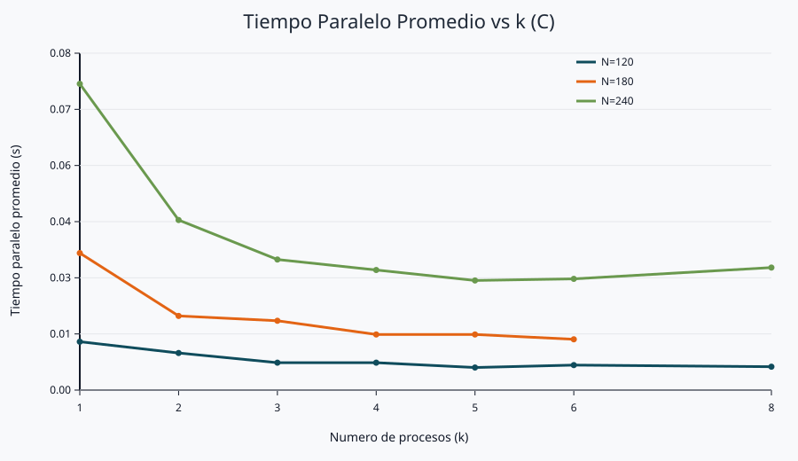
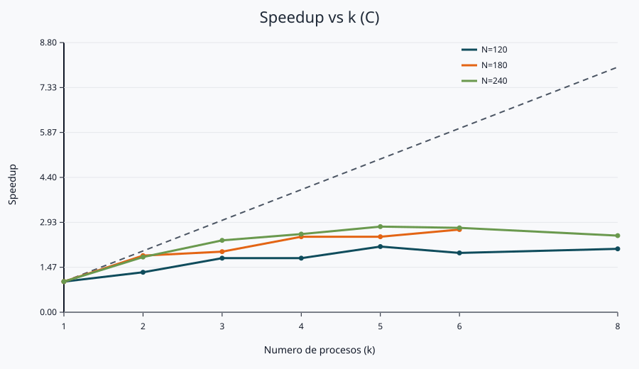
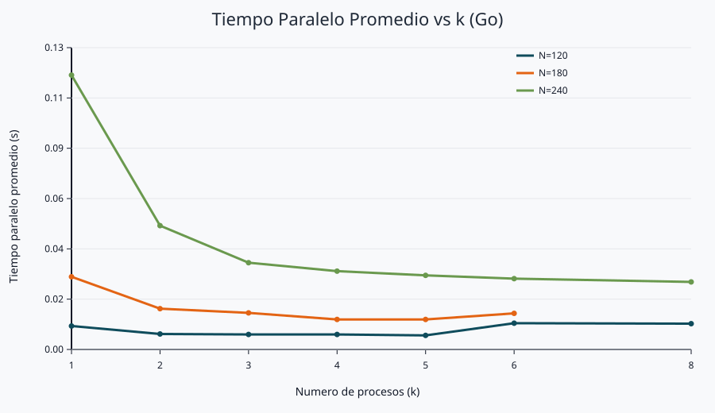
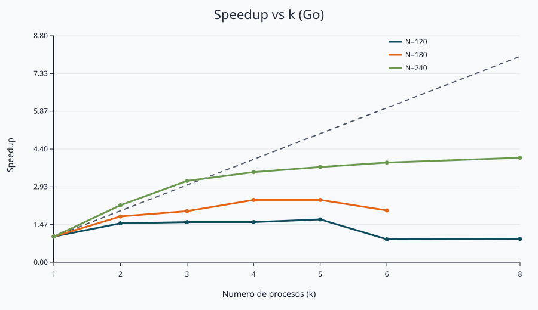

# Laboratorio 3: Multiplicacion de matrices (C y Go)

## Integrantes

- Argenis Medina Morales - argenis.medina@udea.edu.co
- Juan Diego Duque Jimenez - juan.duque31@udea.edu.co

## Cómo ejecutar la version en C

```bash
gcc -o parallel_matrix_multiply parallel_matrix_multiply.c
./parallel_matrix_multiply matrix_a.txt matrix_b.txt result.txt 5
```

## Cómo ejecutar la version en Go

```bash
go mod init parallel_matrix_multiply
go get github.com/gen2brain/shm
go build -o parallel_matrix_multiply parallel_matrix_multiply.go
./parallel_matrix_multiply matrix_a.txt matrix_b.txt result.txt 5
```

## Nota importante del reporte

En ambos lenguajes el mismo binario ejecuta la version secuencial o la paralela segun el valor de `k`:

- `k=1` ejecuta la version secuencial.
- `k>1` ejecuta la version paralela (k subprocesos).

## 1) Eleccion de IPC 

Se eligio memoria compartida System V (`shmget`, `shmat`, `shmctl`) junto con `fork()` por estas razones:

1. La carga es de alto volumen de datos (matrices completas), no de mensajes pequeños.
2. Cada hijo escribe su bloque de filas directamente en memoria compartida, sin serializar ni copiar por `pipe` o cola de mensajes.
3. El problema se divide por filas disjuntas, evitando colisiones de escritura.
4. La sincronizacion se resuelve de forma simple con `waitpid`.

### Trade-off

- Ventaja: bajo costo de transferencia de datos para este problema.
- Costo: manejo manual de memoria compartida y ciclo de vida de procesos.

## 2) Metodologia del analisis (C y Go)

Despues de varios experimentos con diferentes tamanos de matrices y valores de `k`, se obtuvieron los siguientes resultados y graficas. Se midieron los tiempos promedio secuenciales y paralelos, junto con el speedup y la eficiencia.


## 3) Resultados C

| N | k | T_seq prom (s) | T_par prom (s) | Speedup | Efficiency |
|---:|---:|---:|---:|---:|---:|
| 120 | 1 | 0.0120 | 0.0120 | 1.00 | 1.00 |
| 120 | 2 | 0.0120 | 0.0092 | 1.30 | 0.65 |
| 120 | 3 | 0.0120 | 0.0068 | 1.76 | 0.59 |
| 120 | 4 | 0.0120 | 0.0068 | 1.76 | 0.44 |
| 120 | 5 | 0.0120 | 0.0056 | 2.14 | 0.43 |
| 120 | 6 | 0.0120 | 0.0062 | 1.94 | 0.32 |
| 120 | 8 | 0.0120 | 0.0058 | 2.07 | 0.26 |
| 180 | 1 | 0.0340 | 0.0340 | 1.00 | 1.00 |
| 180 | 2 | 0.0340 | 0.0184 | 1.85 | 0.92 |
| 180 | 3 | 0.0340 | 0.0172 | 1.98 | 0.66 |
| 180 | 4 | 0.0340 | 0.0138 | 2.46 | 0.62 |
| 180 | 5 | 0.0340 | 0.0138 | 2.46 | 0.49 |
| 180 | 6 | 0.0340 | 0.0126 | 2.70 | 0.45 |
| 240 | 1 | 0.0760 | 0.0760 | 1.00 | 1.00 |
| 240 | 2 | 0.0760 | 0.0422 | 1.80 | 0.90 |
| 240 | 3 | 0.0760 | 0.0324 | 2.35 | 0.78 |
| 240 | 4 | 0.0760 | 0.0298 | 2.55 | 0.64 |
| 240 | 5 | 0.0760 | 0.0272 | 2.79 | 0.56 |
| 240 | 6 | 0.0760 | 0.0276 | 2.75 | 0.46 |
| 240 | 8 | 0.0760 | 0.0304 | 2.50 | 0.31 |

## 4) Resultados Go

| N | k | T_seq prom (s) | T_par prom (s) | Speedup | Efficiency |
|---:|---:|---:|---:|---:|---:|
| 120 | 1 | 0.0100 | 0.0100 | 1.00 | 1.00 |
| 120 | 2 | 0.0100 | 0.0066 | 1.52 | 0.76 |
| 120 | 3 | 0.0100 | 0.0064 | 1.56 | 0.52 |
| 120 | 4 | 0.0100 | 0.0064 | 1.56 | 0.39 |
| 120 | 5 | 0.0100 | 0.0060 | 1.67 | 0.33 |
| 120 | 6 | 0.0100 | 0.0112 | 0.89 | 0.15 |
| 120 | 8 | 0.0100 | 0.0110 | 0.91 | 0.11 |
| 180 | 1 | 0.0310 | 0.0310 | 1.00 | 1.00 |
| 180 | 2 | 0.0310 | 0.0174 | 1.78 | 0.89 |
| 180 | 3 | 0.0310 | 0.0156 | 1.99 | 0.66 |
| 180 | 4 | 0.0310 | 0.0128 | 2.42 | 0.61 |
| 180 | 5 | 0.0310 | 0.0128 | 2.42 | 0.48 |
| 180 | 6 | 0.0310 | 0.0154 | 2.01 | 0.34 |
| 240 | 1 | 0.1170 | 0.1170 | 1.00 | 1.00 |
| 240 | 2 | 0.1170 | 0.0528 | 2.22 | 1.11 |
| 240 | 3 | 0.1170 | 0.0370 | 3.16 | 1.05 |
| 240 | 4 | 0.1170 | 0.0334 | 3.50 | 0.88 |
| 240 | 5 | 0.1170 | 0.0316 | 3.70 | 0.74 |
| 240 | 6 | 0.1170 | 0.0302 | 3.87 | 0.65 |
| 240 | 8 | 0.1170 | 0.0288 | 4.06 | 0.51 |

## 5) Graficas

### C: Tiempo paralelo promedio vs k



### C: Speedup vs k 



### Go: Tiempo paralelo promedio vs k



### Go: Speedup vs k 



## 6) Interpretacion

1. En ambos lenguajes se observa ganancia con varios valores de `k`, especialmente para `N=240`.
2. En C, el mejor speedup observado fue alrededor de `2.79x` para `N=240, k=5`.
3. En Go, el mejor speedup observado fue alrededor de `4.06x` para `N=240, k=8`.
4. En valores altos de `k`, la eficiencia cae por overhead de procesos, cache y planificacion del SO.

