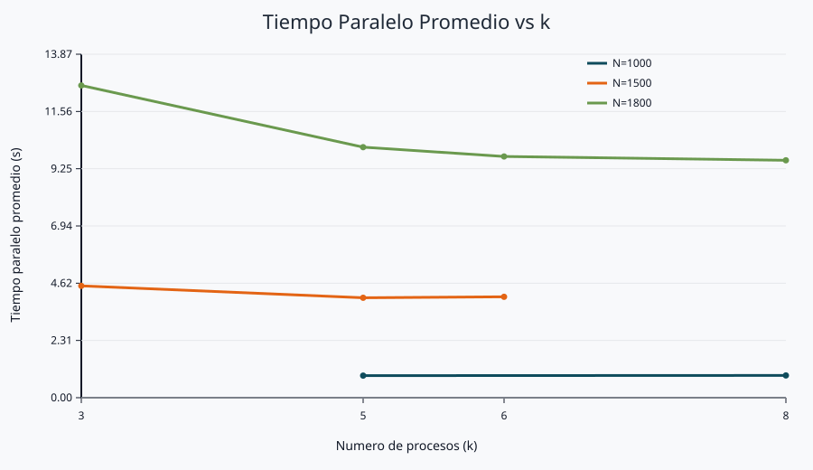
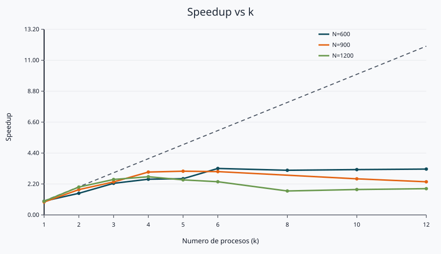

# Laboratorio 3: Multiplicacion de matrices (C y Go)

## Integrantes

- Argenis Medina Morales - argenis.medina@udea.edu.co
- Juan Diego Duque Jimenez - juan.duque31@udea.edu.co

## Cómo ejecutar la version en C

```bash
cd c
gcc -o parallel_matrix_multiply parallel_matrix_multiply.c
./parallel_matrix_multiply matrix_a.txt matrix_b.txt result.txt 5
```

## Cómo ejecutar la version en Go

```bash
cd go
go build -o parallel_matrix_multiply parallel_matrix_multiply.go
./parallel_matrix_multiply matrix_a.txt matrix_b.txt result.txt 5
```

## Nota importante del reporte

En ambos lenguajes el mismo binario ejecuta la version secuencial o la paralela segun el valor de `k`:

- `k=1` ejecuta la version secuencial.
- `k>1` ejecuta la version paralela (k subprocesos).

**El analisis de rendimiento que aparece abajo fue realizado con la version en C**.

## 1) Eleccion de IPC 

Se eligio memoria compartida System V (`shmget`, `shmat`, `shmctl`) junto con `fork()` por estas razones:

1. La carga es de alto volumen de datos (matrices completas), no de mensajes pequeños.
2. Cada hijo escribe su bloque de filas directamente en memoria compartida, sin serializar ni copiar por `pipe` o cola de mensajes.
3. El problema se divide por filas disjuntas, evitando colisiones de escritura.
4. La sincronizacion se resuelve de forma simple con `waitpid`.

### Trade-off

- Ventaja: bajo costo de transferencia de datos para este problema.
- Costo: manejo manual de memoria compartida y ciclo de vida de procesos.

## 2) Metodología del análisis (C)

1. Se compilo el programa en C.
2. Se ejecutaron pruebas con matrices cuadradas grandes: `N = 1000, 1500, 1800`.
3. Se evaluaron valores de `k` en `3 5 6 8` (solo los divisibles por cada `N`).
4. Cada configuracion se repitio `2` veces.
5. Se midieron:
   - `T_seq`: tiempo secuencial promedio
   - `T_par`: tiempo paralelo promedio
   - `Speedup = T_seq / T_par`
   - `Efficiency = Speedup / k`

Archivos generados por el benchmark (carpeta dedicada `benchmark/`):

- `benchmark/benchmark_raw.csv`
- `benchmark/benchmark_summary.csv`
- `benchmark/plots/time_vs_k.svg`
- `benchmark/plots/speedup_vs_k.svg`

## 3) Resultados (matrices grandes)

Fuente: `benchmark/benchmark_summary.csv`

| N | k | T_seq prom (s) | T_par prom (s) | Speedup | Efficiency |
|---:|---:|---:|---:|---:|---:|
| 1000 | 5 | 3.6720 | 0.8915 | 4.12 | 0.82 |
| 1000 | 8 | 3.6720 | 0.8990 | 4.08 | 0.51 |
| 1500 | 3 | 11.0220 | 4.5160 | 2.44 | 0.81 |
| 1500 | 5 | 11.0220 | 4.0360 | 2.73 | 0.55 |
| 1500 | 6 | 11.0220 | 4.0750 | 2.70 | 0.45 |
| 1800 | 3 | 32.5800 | 12.6110 | 2.58 | 0.86 |
| 1800 | 5 | 32.5800 | 10.1185 | 3.22 | 0.64 |
| 1800 | 6 | 32.5800 | 9.7425 | 3.34 | 0.56 |
| 1800 | 8 | 32.5800 | 9.5885 | 3.40 | 0.42 |

## 4) Gráficas

### Tiempo paralelo promedio vs k



### Speedup vs k (incluye referencia ideal S(k)=k)



## 5) Interpretación

1. El uso de `fork + IPC + wait` introduce overhead, pero para estos tamanos de matriz se observan speedups mayores a `2x`.
2. Con matrices grandes aparece ganancia clara por paralelismo real.
3. El mejor speedup medido fue aproximadamente `4.12x` en `N=1000, k=5`.
4. Al aumentar demasiado `k`, la eficiencia cae por costos de coordinación, cache y planificacion del SO.

## 6) Reproducibilidad

Para regenerar el análisis con matrices grandes:

```bash
cd benchmark
python3 benchmark.py --sizes 1000 1500 1800 --k-values 3 5 6 8 --repeats 2
python3 plot_svg.py
```

Esto recrea el CSV de resultados y las gráficas en `benchmark/plots/`.
